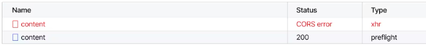
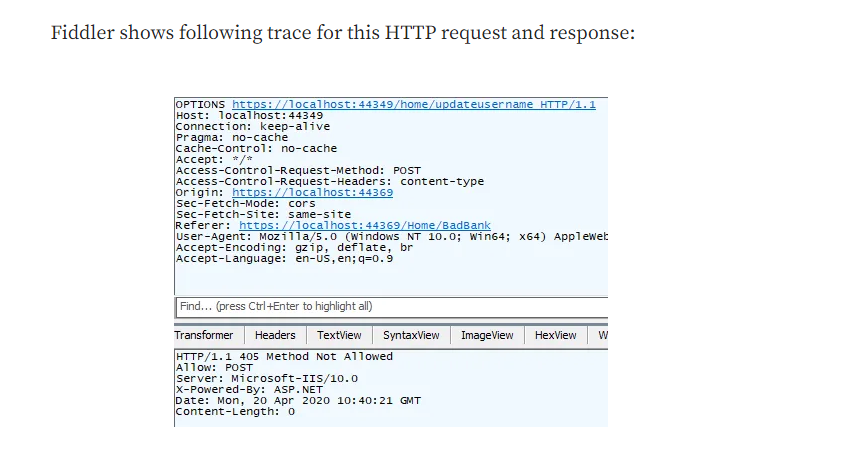

so lets talk about cors 
https://maddevs.io/blog/web-security-an-overview-of-sop-cors-and-csrf/

https://portswigger.net/web-security/learning-paths/cors/cors-what-is-cors-cross-origin-resource-sharing/cors/what-is-cors-cross-origin-resource-sharing

https://medium.com/@zhaojunemail/sop-cors-csrf-and-xss-simply-explained-with-examples-af6119156726

we have the sop or the same origin policy. it is the restriction with what javascript can interact with. 
it is a browser side constraint. 
so , lets say you try to hit a endpoint from example.com from malicious.com , you will get a response code of 200 in your browser but browser wont let you read it. you can use something like fiddler and you can see server actually sends the response. 

Now , sop is very restrictive. we need something to relax it. that is where cors comes in.  enable CORS, the server needs to tell browser that he is happy to handle cross-origin request. so we tell him this domains , headers  and methods are okay 


cors request can be divided into 2 types 
* safe request 
* preflighted

#### Safe request 
A safe request is idempotent. (you can do it 100 times , it does not matter, like GET,HEAD)
why dont we put HEAD on a request to know more baout a endpoint lol 
 in cors , the policy of the website does not block simple request the request is successful but the response is blocked and broswer does not show the response(you get the content length and everything and a 200 response, but broswer is like naaa)
 
 
#### Preflight request 
we get the same cors error as the normal request, but in preflight request , we see 2 requests.  

we first send the preflight request and it looks something like this 

##### Request Body
```
OPTIONS /data HTTP/1.1
Host: api.example.com
Origin: http://frontend.example.com
Access-Control-Request-Method: POST
```
the response would be something like 
##### Response Body
```
HTTP/1.1 204 No Content
Access-Control-Allow-Origin: http://frontend.example.com
Access-Control-Allow-Methods: PUT
Access-Control-Allow-Headers: Content-Type
```
this will fail as the `Access-Control-Allow-Origin` only allows `PUT` and the request. 

Now lets see CSRF 

now csrf tokens , why cant they be copied in your request, chatgpt says httponly requests cannot be copied by javascript. 

question : so cors blockage is happening from server end, then what is the point of javascript 

https://stackoverflow.com/questions/24680302/csrf-protection-with-cors-origin-header-vs-csrf-token

