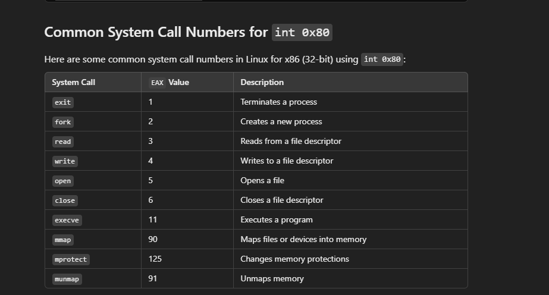

    addr.sin_port = htons(8080); // Convert port number to network byte order

Network byte order is big-endian, so on systems that use little-endian (like x86 processors), htons swaps the byte order. On big-endian systems, the function returns the value unchanged.

    dec eax
    jnz $ - 2      ; Jump back 2 bytes to 'dec eax' if EAX is not zero

NASM will accept it, others wont 

The `int 0x80` instruction in Linux x86 assembly is an interrupt used to make **system calls**. When you execute `int 0x80`, it triggers a software interrupt that tells the Linux kernel to perform a system call based on the values in the registers.

Here’s how it works:

## How `int 0x80` Works

### System Call Number (in `EAX`):
Before calling `int 0x80`, you load the **system call number** into the `EAX` register. This number identifies the specific system call you want to execute.

For example:
- `mov eax, 1` is the system call number for `exit`.
- `mov eax, 4` is the system call number for `write`.
- `mov eax, 5` is the system call number for `open`.

### System Call Arguments (in other registers):
Arguments for the system call are passed through other registers:
- **`EBX`**: First argument
- **`ECX`**: Second argument
- **`EDX`**: Third argument
- **`ESI`**: Fourth argument (used in some system calls)
- **`EDI`**: Fifth argument (used in some system calls)

For example, in a `write` system call (`eax = 4`), you would pass:
- `ebx` = file descriptor
- `ecx` = pointer to the data buffer
- `edx` = number of bytes to write

### Executing the System Call:
When `int 0x80` is executed, the kernel takes control, reads the values in the registers, and performs the corresponding system call.

### Return Value:
After the system call completes, the return value (if any) is stored in `EAX`. For instance, if the system call fails, `EAX` will typically contain a negative error code.

## Example: Using `int 0x80` for a `write` System Call
Here’s an example of using `int 0x80` to call the `write` system call to output text to the terminal:

```assembly
section .data
msg db "Hello, World!", 0xA       ; Message to print, newline at the end
len equ $ - msg                    ; Calculate length of msg

section .text
global _start

_start:
    mov eax, 4                     ; System call number for 'write'
    mov ebx, 1                     ; File descriptor 1 = standard output
    mov ecx, msg                   ; Pointer to message
    mov edx, len                   ; Length of message
    int 0x80                       ; Call the kernel

    mov eax, 1                     ; System call number for 'exit'
    xor ebx, ebx                   ; Return 0 status
    int 0x80                       ; Call the kernel to exit

```



| 64-bit register | Lower 32 bits | Lower 16 bits | Lower 8 bits |
|-----------------|---------------|---------------|--------------|
| rax             | eax           | ax            | al           |
| rbx             | ebx           | bx            | bl           |
| rcx             | ecx           | cx            | cl           |
| rdx             | edx           | dx            | dl           |
| rsi             | esi           | si            | sil          |
| rdi             | edi           | di            | dil          |
| rbp             | ebp           | bp            | bpl          |
| rsp             | esp           | sp            | spl          |
| r8              | r8d           | r8w           | r8b (r8l)    |
| r9              | r9d           | r9w           | r9b (r9l)    |
| r10             | r10d          | r10w          | r10b (r10l)  |
| r11             | r11d          | r11w          | r11b (r11l)  |
| r12             | r12d          | r12w          | r12b (r12l)  |
| r13             | r13d          | r13w          | r13b (r13l)  |
| r14             | r14d          | r14w          | r14b (r14l)  |
| r15             | r15d          | r15w          | r15b (r15l)  |
| r16 (with APX)  | r16d          | r16w          | r16b (r16l)  |
| r17 (with APX)  | r17d          | r17w          | r17b (r17l)  |
| ...             | ...           | ...           | ...          |
| r31 (with APX)  | r31d          | r31w          | r31b (r31l)  |
