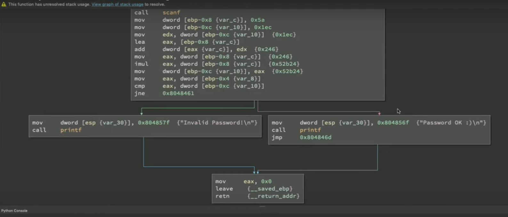

we do symbolic execution today with angr 
binary ninja to see this view 

we have tools like 
https://www.tenable.com/products/nessus
https://www.qualys.com/apps/vulnerability-management-detection-response/
https://www.openvas.org/

can we use graphs of the equations to determine a sample space of inputs that satisfy the conditions 

so your sast tools majorly work on owasp top ten 
osstmm 
check 
Accuracy:
False Positive/False Negative rates
OWASP Benchmark score

CHECK - penetration testing
CHECK is the scheme under which NCSC approved companies can conduct authorised penetration tests of public sector and CNI systems and networks.
