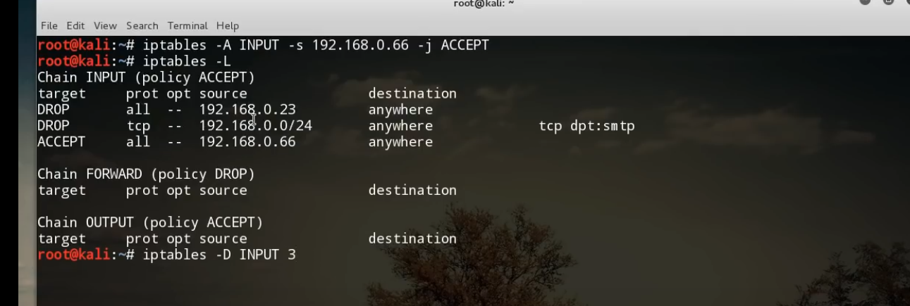
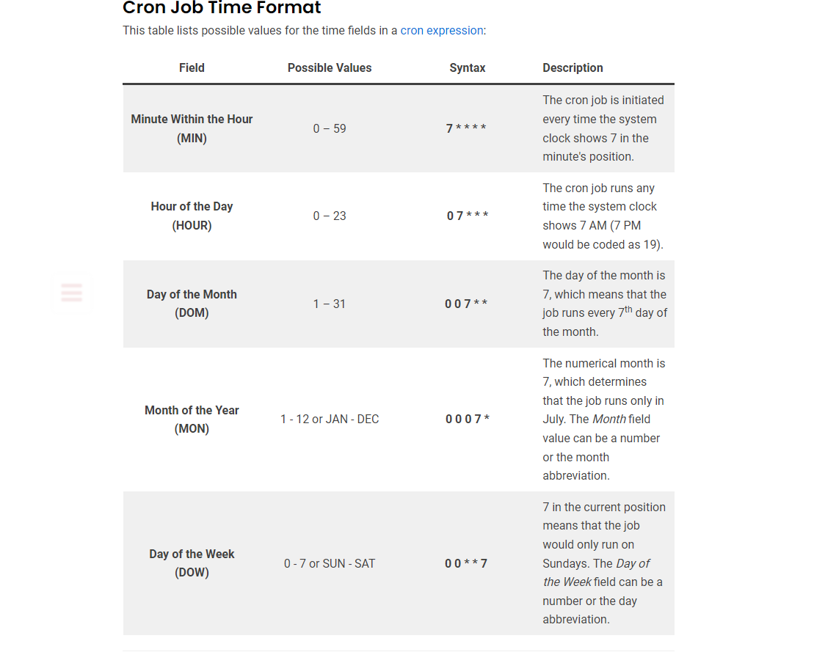

### Users and Groups Management
useradd sometimes does not create home directory and other stuff
```
sudo adduser newuser
sudo groupadd newgroup
sudo usermod -aG newgroup newuser
sudo userdel newuser
sudo groupdel newgroup
groupadd -p <password> groupname
```
Verify the group creation: Check the /etc/group file (the primary file that keeps track of all groups) to confirm the new group has been created.

### File and Directory Permissions
The first set of permissions applies to the owner of the file. The second set of permissions applies to the user group that owns the file. The third set of permissions is generally referred to as "others." All Linux files belong to an owner and a group.
r (read): 4
w (write): 2
x (execute): 1

```
chmod 755 filename
sudo chown user:group filename
```

### Zip and Tar Files

```
zip file.zip filename
unzip file.zip
tar -cvf file.tar filename
tar -xvf file.tar
```

### Process Management
```
ps aux
kill pid
pidof systemd
```

### File Transfer via SCP

Send file to remote server:
```
scp file user@remote_server:/path
```

Get file from remote server:
```
scp user@remote_server:/path/file .
```

### Run Commands with Other User’s Privileges

```
sudo -u anotheruser command
```

### IP Addresses and Opened Ports

```
ip addr
sudo netstat -tuln
sudo ss -tuln
```

### Start/Stop Network Services

```
sudo systemctl start service_name
sudo systemctl stop service_name
sudo systemctl restart service_name
```

### Manage System Firewall

to get firewall zones 

```
[tcarrigan@server ~]$ firewall-cmd --get-zones
block dmz drop external home internal libvirt public trusted work
```

Many times, it is helpful to see what services are associated with a given zone. To display this information, use the following command:

```
[tcarrigan@server ~]$ firewall-cmd --list-all
public (active)
  target: default
  icmp-block-inversion: no
  interfaces: enp0s3 enp0s8
  sources: 
  services: cockpit dhcpv6-client mountd nfs rpc-bind ssh
  ports: 
  protocols: 
  masquerade: no
  forward-ports: 
  source-ports: 
  icmp-blocks: 
  rich rules: 
```
If you wish to specify a zone, you simply add --zone=zonename

For example, to see the external zone , use the following:

```
[tcarrigan@server ~]$ firewall-cmd --zone=external --list-all
external
  target: default
  icmp-block-inversion: no
  interfaces: 
  sources: 
  services: ssh
  ports: 
  protocols: 
  masquerade: yes
  forward-ports: 
  source-ports: 
  icmp-blocks: 
  rich rules: 
```

Now, what happens when you need to allow traffic over a non-standard port? Imagine you have a backup service that needs to run over a dedicated UDP port. How would you add this exception to your zone? The syntax is very user friendly and is only slightly different from what we used for services. To add a port to your zone configuration, use the following:

```
[tcarrigan@server ~]$ sudo firewall-cmd --permanent --zone=external --add-port=60001/udp
```

we use the `--permanent` flag so that we can make sure that even after reload, firewalld maintains its stuff. 

```
[tcarrigan@server ~]$ sudo firewall-cmd --reload
```
https://www.redhat.com/sysadmin/beginners-guide-firewalld


##### some iptables stuff 

https://www.youtube.com/watch?v=eC8scXX1_1M

```
iptables -A INPUT -s 192.168.0.1 DROP
```
-A = append 
-s = source 
we can put a subent mask as well 

```
iptables -A INPUT -s 192.168.0.0/24 -p tcp --destination-port 25  DROP
```
 -p =protocols

 ###### TO accept 

```
iptables -A INPUT -s 192.168.0.1 -j ACCEPT
```

##### to delete a rule


so acept wont work here as it is the third rule , it gets blocked by first 2

now to add it to the first (-A appends it)
to the top of the chain, we use -I 

```
iptables -I INPUT -s 192.168.0.1 -j ACCEPT
```

### Docker containers

```
docker pull image_name
docker run -d image_name

```

### Cronjob 

```
MIN HOUR DOM MON DOW CMD
```
The first five fields, each separated by a single space, represent time intervals: MIN for minutes, HOUR for hours, DOM for day of the month, MON for month, and DOW for day of the week. They tell Cron when to initiate the cron job.

```
0 9 1 1 * /path/to/your_script.sh
```
Each field has its own set of permissible values, which can be accompanied or swapped for a special character. The asterisk (*) operator in this example instructs Cron to execute the job regardless of which day of the week falls on January 1st.



### for bash scripting 
https://ryanstutorials.net/bash-scripting-tutorial/bash-input.php
