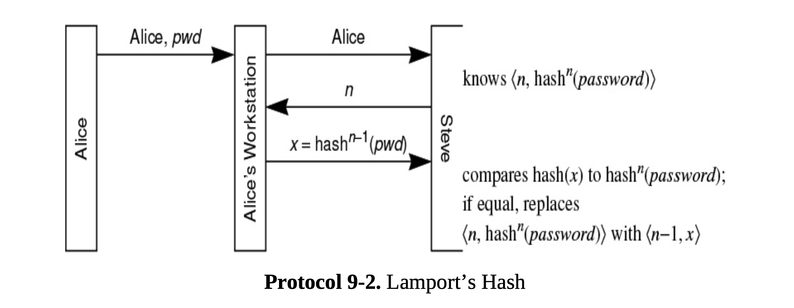

how do we analyse authentication protocols 
there are , umm ways to do that 

messages sent before a time are considered in the past and a auth protocol should prevent any such messages to be acepted in the present. 

 ban logic today, 
ban verified needam-schroeder as secure 

Unfortunately, even computer-computer authentication is often based on passwords. Sometimes, cryptography is not used because the protocol started out as a human-computer protocol and was not redesigned when its use got expanded to computer-computer communication.

Compromising the routing protocol is a common problem with BGP [RFC
4271]. BGP is very fragile and configuration intensive. For instance, in 2008,
Pakistan was attempting to block access to YouTube from within Pakistan, so
they had their BGP router advertise that it was the best path to YouTube’s IP
address. Since Internet routing prefers the most specific destination address
regardless of distance, and since everyone else was advertising an address block
containing YouTube’s address, all traffic worldwide for YouTube was routed to
Pakistan’s BGP router, resulting in accidentally blocking access to YouTube
worldwide.

then there is lamport hash 
it works this way 
you send alice,pwd 
server returns a n
alice sends a hash,n-1(x)
server does a hash one more time to get hash(x)
if they match, goodie 
and server does n-=1

so when n=1, redo password 

problem = small n attack 
attacker can send alice with a small n like 50
alice responds with hash50(pwd) , attacker can impersonate alice for sometime 

The protocols enabling identity providers were designed to fit with
mechanisms already in browsers (HTTP, cookies, redirects). There are various
standards, including OpenID Connect and SAML. OpenID Connect is an
authentication protocol that is layered on top of OAuth 2.0. SAML has pretty
much the same functionality as OpenID/OAuth but with different syntax (SAML
uses XML) and defined by a different standards organization.

