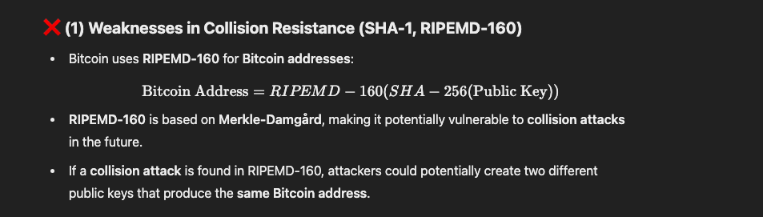

preimage 
given y, you cant find any x such that hash(x)==y 

2nd preimage 
given x,y such that hash(x)==y , you cant find a x' where 
x' != x 
and hash(x')==y 

collision resistance 
nobody can find a x,z such that 
hash(x)==hash(z)

practically speaking collision resistance is harder 
collosion resistance is broken, preimage resistance is not broken yet 

hash functions have length extension types attacks 

Summary: Length Extension Attack
A Length Extension Attack exploits the way Merkle-Damgård-based hash functions (e.g., MD5, SHA-1, SHA-256) process data in blocks. It allows an attacker to append extra data to a hashed message without knowing the secret and still produce a valid hash.

How the Attack Works:
The server hashes a message with a secret prefix:
𝐻(secret∣∣message)
The attacker sees the message and its hash but does not know the secret.
Because of Merkle-Damgård, the final hash output acts as the last internal state, allowing the attacker to continue hashing from it.
The attacker guesses the original message length, reconstructs the padding, and appends new data.
The attacker computes a new valid hash for: H(\text{previous state}, \text{padding} || \text{"&admin=true"})
 without knowing the secret. (previous state is the previous hash)
The server verifies the hash and accepts the modified request.
Why It Works:
Merkle-Damgård allows continued hashing from an intermediate state.
Padding is deterministic, so the attacker can reconstruct it.
The final hash exposes internal state, enabling hash extension.

✅ SHA-3 (Keccak)
Uses the sponge construction, which does not allow length extension.
More resistant to collision and preimage attacks.
Officially standardized as the successor to SHA-2.

Lamport signs 
if you give me multiple signatures, i may be able to construct a sign that i can forge 
but for that i required 2^128 attempts 
hence you never reuse them. 