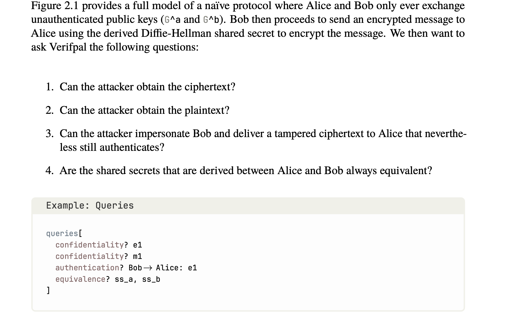

okay so today we fuck with verifpal

i dont like it when formal verification methods have a lot of implicit declarations. it makes me ask more hows than is needed. 

also you can generate proverif code from verifpal 

the manual is also better written , with a comic in the beginning which I suppose you can ignore.  

i am on a flight without verifpal extensions, (is this the new defination of raw dogging , earlier this was the norm ig)

oh btw, verifpal has predefined primitives, so you dont need to go around writing your own `reduc` or `equation` , unless you enjoyed the abstract nature of it. (nothing to complain, just having primitives is helpful since I ain't gonna change them for my use case, if you need to do so, or are at a level where that level of control is required, I might have more to learn from you) 

there is also something like a VerifHub where you can post  your protocols and get opinions. I might use it sometime soon. 

Conclusion : I tried to verify a very simple protocol on verifpal, the signature verification primitive SIGVERIFY does not work as expected. even if it fails, the execution continues for that trace which is unacceptable. 
